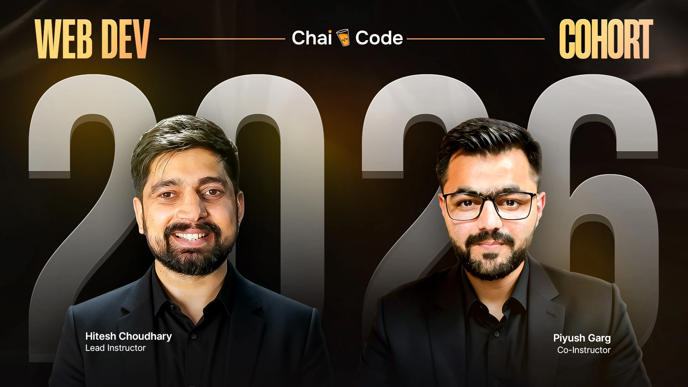

<a href="https://courses.chaicode.com/">
  

    
  

</a>
<h1 align="center">Chai Aur Cohort</h1>

  
  
  

## Introduction

**Chai Aur Cohort** is a full-stack web development course in MERN Stack by **[Hitesh Choudhary](https://x.com/@Hiteshdotcom)** & **[Piyush Garg](https://x.com/@piyushgarg_dev)**. From basics to full-stack dev, this repository documents my in-depth learning journey within the program.

## Documentation

- #### [Assignments : learn](./assignments/README.md)

- #### [Blogs : showcase](./blogs/README.md)
