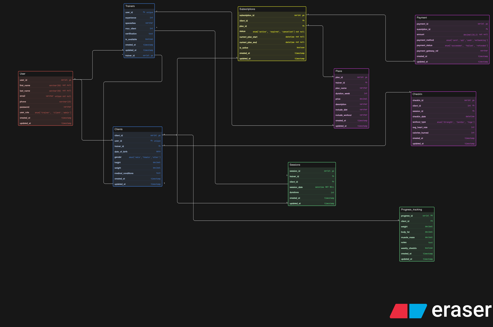

# Fitness Influencer Coaching Platform (DB Design)

## Problem Statement:

A fitness influencer has started an online coaching business. Initially, they train a few people through Insta DMs and Meet video calls. As their brand grows, they now want a platform where they can onboard clients, sell fitness plans, schedule consultations, manage subscriptions, track client progress and maintain regular check-ins.

Some users join only for consultation. Some buy long-term coaching plans. Some may attend live sessions, while others may only receive a training routine and diet guidance. The platform should also be able to track progress information such as weight, body measurements, check-in reports and trainer notes.

Your job is to design the ER diagram for this platform.

This is not a gym management problem. This is more of an online coaching ecosystem where one or more trainers/influencers manage multiple clients and provide structured online fitness support.

### ER Diagram:

## USER TABLE

Stores authentication + basic account info for everyone (trainer, client, admin).

| Attribute          | Description                                |
| ------------------ | ------------------------------------------ |
| **user_id (PK)**   | Unique ID for each user.                   |
| **first_name**     | User’s first name.                         |
| **last_name**      | User’s last name.                          |
| **email (unique)** | Login email address.                       |
| **phone**          | Contact number.                            |
| **password**       | Encrypted password.                        |
| **user_role**      | Role of user → `trainer / client / admin`. |
| **created_at**     | Account creation timestamp.                |
| **updated_at**     | Last profile update time.                  |

---

## TRAINERS TABLE

Extra details only for trainer users.

| Attribute                   | Description                                      |
| --------------------------- | ------------------------------------------------ |
| **trainer_id (PK)**         | Unique trainer identifier.                       |
| **user_id (FK)**            | Links trainer to Users table.                    |
| **experience**              | Years of training experience.                    |
| **specialties**             | Trainer specialization (strength, cardio, yoga). |
| **max_clients**             | Maximum clients trainer can handle.              |
| **certifications**          | Trainer certifications.                          |
| **is_available**            | Trainer availability status.                     |
| **created_at / updated_at** | Record timestamps.                               |

---

## CLIENTS TABLE

Extra profile data for clients.

| Attribute                   | Description               |
| --------------------------- | ------------------------- |
| **client_id (PK)**          | Unique client identifier. |
| **user_id (FK)**            | Links to Users table.     |
| **trainer_id (FK)**         | Assigned trainer.         |
| **date_of_birth**           | Client birth date.        |
| **gender**                  | `male / female / other`.  |
| **height**                  | Height of client.         |
| **weight**                  | Current weight.           |
| **medical_conditions**      | Any health issues.        |
| **created_at / updated_at** | Record timestamps.        |

---

## PLANS TABLE

Fitness programs created by trainers.

| Attribute                   | Description                       |
| --------------------------- | --------------------------------- |
| **plan_id (PK)**            | Unique plan ID.                   |
| **trainer_id (FK)**         | Trainer who created the plan.     |
| **plan_name**               | Plan title.                       |
| **duration_weeks**          | Plan length in weeks.             |
| **price**                   | Cost of the plan.                 |
| **description**             | Plan details.                     |
| **include_diet**            | Whether diet plan is included.    |
| **include_workout**         | Whether workout plan is included. |
| **created_at / updated_at** | Record timestamps.                |

---

## SUBSCRIPTIONS TABLE

Tracks client plan subscriptions.

| Attribute                   | Description                     |
| --------------------------- | ------------------------------- |
| **subscription_id (PK)**    | Unique subscription ID.         |
| **client_id (FK)**          | Subscribed client.              |
| **plan_id (FK)**            | Selected plan.                  |
| **status**                  | `active / expired / cancelled`. |
| **current_plan_start**      | Subscription start date.        |
| **current_plan_end**        | Expiry date.                    |
| **is_active**               | Indicates active subscription.  |
| **created_at / updated_at** | Record timestamps.              |

---

## PAYMENT TABLE

Stores payment transactions.

| Attribute                   | Description                       |
| --------------------------- | --------------------------------- |
| **payment_id (PK)**         | Unique payment record.            |
| **subscription_id (FK)**    | Related subscription.             |
| **amount**                  | Paid amount.                      |
| **payment_method**          | `card / upi / cash / netbanking`. |
| **payment_status**          | `succeeded / failed / refunded`.  |
| **payment_gateway_ref**     | Payment gateway transaction ID.   |
| **created_at / updated_at** | Record timestamps.                |

---

## SESSIONS TABLE

Trainer–client workout sessions.

| Attribute                   | Description               |
| --------------------------- | ------------------------- |
| **session_id (PK)**         | Unique session ID.        |
| **trainer_id (FK)**         | Assigned trainer.         |
| **client_id (FK)**          | Client attending session. |
| **session_date**            | Date & time of session.   |
| **duration**                | Session length (minutes). |
| **created_at / updated_at** | Record timestamps.        |

---

## CHECKIN TABLE

Tracks gym visits.

| Attribute                   | Description                        |
| --------------------------- | ---------------------------------- |
| **checkin_id (PK)**         | Unique check-in record.            |
| **client_id (FK)**          | Client who checked in.             |
| **session_id (FK)**         | Related session (optional).        |
| **checkin_date**            | Date/time of visit.                |
| **workout_type**            | `Strength / Cardio / Yoga`.        |
| **avg_heart_rate**          | Average heart rate during workout. |
| **calories_burned**         | Estimated calories burned.         |
| **created_at / updated_at** | Record timestamps.                 |

---

## PROGRESS_TRACKING TABLE

Tracks client fitness progress over time.

| Attribute                   | Description                         |
| --------------------------- | ----------------------------------- |
| **progress_id (PK)**        | Unique progress entry.              |
| **client_id (FK)**          | Client being tracked.               |
| **weight**                  | Current weight measurement.         |
| **body_fat**                | Body fat percentage.                |
| **muscle_mass**             | Muscle mass measurement.            |
| **notes**                   | Trainer notes.                      |
| **weekly_checkin**          | Whether it's weekly progress entry. |
| **created_at / updated_at** | Record timestamps.                  |
