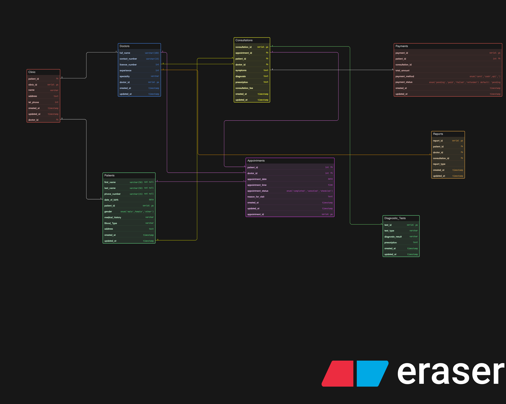

# Clinic Appointment and Diagnostics Platform

A modern clinic wants to organize its operations digitally. They want to manage doctors, patients, appointments, consultations, diagnostic tests, reports, and payments. Patients should be able to visit doctors, book appointments, undergo tests if prescribed, and receive reports later.

The clinic may have multiple doctors across different departments or specialties. A patient may visit the clinic multiple times. During a visit, the doctor may prescribe one or more diagnostic tests. The diagnostic reports may be generated later and linked back to the patient and doctor visit.

Your task is to design the ER diagram for this clinic system.

This assignment is not about making a hospital-level giant system. Keep it focused on a clinic that handles appointments, consultations, diagnostics, and reporting in a clean and scalable way.

### ER Diagram:

Below is a detailed breakdown of every attribute within the Clinic Management System database, organized by table. This serves as a data dictionary for developers and database administrators.

## Clinic Table
Defines the physical facility information.

- clinic_id: (Primary Key) Unique identifier for the clinic.

- name: The official name of the medical facility.

- address: The physical location of the clinic.

- tel_phone: Primary contact number for the facility.

- doctor_id: (Foreign Key) Reference to the doctor associated with or managing the clinic.

- created_at / updated_at: Timestamps for record creation and last modification.

## Doctors Table
Stores professional data for healthcare providers.

- doctor_id: (Primary Key) Unique identifier for the doctor.

- full_name: The doctor's legal name.

- contact_number: Personal or office contact line.

- license_number: Professional medical certification number.

- experience: Number of years in practice (Integer).

- specialty: Field of medicine (e.g., Pediatrics, Cardiology).

- created_at / updated_at: Standard audit timestamps.

## Patients Table
Comprehensive record of individuals receiving care.

- patient_id: (Primary Key) Unique identifier for the patient.

- first_name / last_name: Patient's legal name components.

- phone_number: Primary contact for the patient (Not Null).

- date_of_birth: Used for age verification and identity.

- gender: Categorized as male, female, or other.

- medical_history: Long-form text describing past conditions/surgeries.

- blood_type: Specific blood group (e.g., A+, O-).

- address: Residential location of the patient.

- created_at / updated_at: Standard audit timestamps.

## Appointments Table
The scheduling layer connecting patients and doctors.

- appointment_id: (Primary Key) Unique identifier for the booking.

- patient_id / doctor_id: (Foreign Keys) Links the two parties involved.

- appointment_date: The calendar date of the visit.

- appointment_time: The specific time slot.

- appointment_status: Current state: scheduled, completed, or canceled.

- reason_for_visit: Brief description of the patient's concern.

- created_at / updated_at: Standard audit timestamps.

## Consultations Table
The clinical notes generated during a visit.

- consultation_id: (Primary Key) Unique identifier for the session.

- appointment_id: (Foreign Key) Links back to the original booking.

- patient_id / doctor_id: (Foreign Keys) Redundant links for quick clinical lookups.

- symptoms: Subjective complaints reported by the patient.

- diagnosis: The doctor's professional finding.

- prescription: Medication or treatment plan provided.

- consultation_fee: The cost associated specifically with the visit.

- created_at / updated_at: Standard audit timestamps.

## Payments Table
Financial records for billing and accounting.

- payment_id: (Primary Key) Unique transaction ID.

- patient_id: (Foreign Key) Identifies who is paying.

- consultation_id: (Foreign Key) Identifies what is being paid for.

- total_amount: The final bill amount.

- payment_method: Method used: card, cash, or upi.

- payment_status: State: pending, paid, failed, or refunded.

- created_at / updated_at: Standard audit timestamps.

## Diagnostic_Tests Table
Lab work and imaging orders.

- test_id: (Primary Key) Unique identifier for the test.

- test_type: Category (e.g., Blood Test, X-Ray).

- diagnosis_result: The outcome or findings of the test.

- prescription: (Foreign Key/Link) Connection to the clinical order.

- created_at / updated_at: Standard audit timestamps.

## Reports Table
Generated documents for administrative or medical review.

- report_id: (Primary Key) Unique report ID.

- patient_id / doctor_id: (Foreign Keys) Stakeholders associated with the report.

- consultation_id: (Foreign Key) The medical event being reported on.

- report_type: Categorization (e.g., Monthly Revenue, Patient Health Summary).

- created_at / updated_at: Standard audit timestamps.