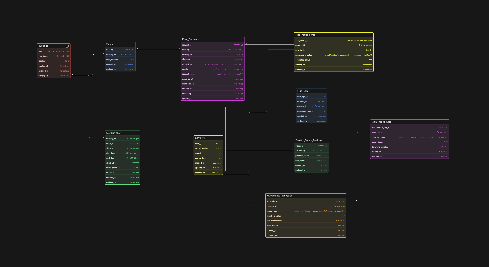

# Smart Elevator Control

A fast-growing infrastructure technology company called LiftGrid Systems builds intelligent elevator control platforms for large commercial buildings across India.

Their software is used in corporate towers, malls, airports, hospitals and high-rise residential complexes where dozens of elevators operate together across many floors.

Unlike small standalone lifts, these buildings run multiple elevators per building, grouped into zones, handling thousands of passengers daily. The system must manage elevator assignments, floor requests, maintenance tracking and ride logs efficiently.

Each building can contain multiple elevator shafts. Each shaft contains one elevator. Each elevator moves across a defined set of floors and responds to ride requests generated by users from different floors.

The system should support:

- multiple buildings

- multiple elevators inside each building

- floor-level request tracking

- ride allocation to elevators

- elevator status monitoring

- maintenance tracking

- usage history logging

This backend platform helps operations teams monitor performance and ensures elevators remain safe, efficient and available.

Your task is to design the ER diagram for this smart elevator control system.

This is a multi-building infrastructure management system handling real-time movement requests, elevator allocation and operational tracking.

### ER Diagram:

# Core Architecture

## Infrastructure Layer

- Buildings: The top-level entity. Stores location and total floor count.

- Floors: Maps specific floor numbers to buildings.

- Elevator_Shaft: Represents the physical vertical space within a building that houses one or more elevator cars.

## Operational Layer

- Elevators: The heart of the system. Tracks the current_floor, capacity, and status (Idle, Moving Up, Moving Down, Maintenance, Emergency).

- Floor_Requests: Captures user intent (which floor, which building, and direction). Includes a priority enum to handle VIP or Emergency overrides.

- Ride_Assignments: The bridge between a request and a specific elevator. Tracks estimated_arrival and assignment status.

## Analytics & Logging Layer

- Ride_Logs: Historical data of completed trips, including passenger counts for traffic analysis.

- Elevator_Status_Tracking: A state-change log that records every transition of an elevator’s status for debugging and performance auditing.

## Maintenance Layer

- Maintenance_Schedules: Defines when an elevator needs service based on time_based, usage_based, or sensor_threshold triggers.

- Maintenance_Logs: Records the actual work performed, issue categories (Hardware, Software, Sensor), and total downtime.

## Tech Stack

- Data Types Used: * SERIAL PK for auto-incrementing IDs.

- ENUM for state management (Status, Priority, Direction).

- TIMESTAMP for real-time auditing.

- INT and VARCHAR for standard attributes.

### Entity Relationship Summary

- Building → Floors: One-to-Many (A building has many floors).

- Building → Elevator_Shaft: One-to-Many.

- Elevator_Shaft → Elevators: One-to-Many (Multiple cars can operate in one shaft system).

- Elevators → Ride_Assignments: One-to-Many (An elevator can have multiple queued assignments).

- Elevators → Maintenance: One-to-Many (Tracking the lifecycle of a specific unit).