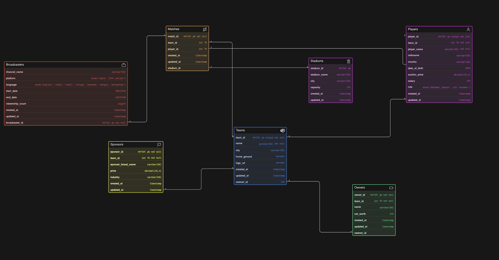

# IPL Database Diagram Documentation

## Overview

This document describes the database diagram for an Indian Premier League (IPL) schema. It lists each table and every attribute included in the diagram, along with the declared data type and constraints.

## Diagram

## Tables and Attributes

### Teams

- `team_id` — `serial`, primary key, unique, not null
- `name` — `varchar(50)`, not null
- `city` — `varchar(50)`
- `owener_id` — `int`
- `home_ground` — `varchar`
- `logo_url` — `varchar`
- `created_at` — `timestamp`
- `updated_at` — `timestamp`

### Players

- `player_id` — `serial`, primary key, unique, not null
- `team_id` — `int`, foreign key, not null
- `player_name` — `varchar(50)`, not null
- `nickname` — `varchar(50)`
- `country` — `varchar(50)`
- `date_of_birth` — `date`
- `auction_price` — `decimal(10,4)`
- `salary` — `int`
- `role` — `enum('batsman',bowler','all rounder')`
- `created_at` — `timestamp`
- `updated_at` — `timestamp`

### Owners

- `owner_id` — `serial`, primary key, not null
- `team_id` — `int`, foreign key, not null
- `name` — `varchar(50)`
- `net_worth` — `int`
- `created_at` — `timestamp`
- `updated_at` — `timestamp`

### Sponsors

- `sponsor_id` — `serial`, primary key, not null
- `team_id` — `int`, foreign key, not null
- `sponcer_brand_name` — `carchar(50)`
- `price` — `decimal(18,4)`
- `industry` — `varchar(50)`
- `created_at` — `timestamp`
- `updated_at` — `timestamp`

### Matches

- `match_id` — `serial`, primary key, not null
- `team_id` — `int`, foreign key
- `player_id` — `int`, foreign key
- `created_at` — `timestamp`
- `updated_at` — `timestamp`

### Stadiums

- `stadium_id` — `serial`, primary key
- `stadium_name` — `varchar(50)`
- `city` — `varchar(50)`
- `capacity` — `int`
- `created_at` — `timestamp`
- `updated_at` — `timestamp`

### Broadcasters

- `broadcaster_id` — `serial`, primary key, not null
- `channel_name` — `varchar(50)`
- `platform` — `enum('cable','DTH',online')`
- `language` — `enum('english','hindi','tamil','teluga','kannada','bangla','malayalam')`
- `start_date` — `datetime`
- `end_date` — `datetime`
- `viewership_count` — `bigint`
- `created_at` — `timestamp`
- `updated_at` — `timestamp`

## Relationships

- `Teams.team_id` → `Players.team_id`
- `Teams.owener_id` → `Owners.owener_id`
- `Teams.team_id` → `Sponsors.team_id`
- `Teams.team_id` → `Matches.team_id`
- `Players.player_id` → `Matches.player_id`
- `Stadiums.stadium_id` → `Matches.stadium_id`
- `Broadcasters.broadcaster_id` <> `Matches.match_id`

