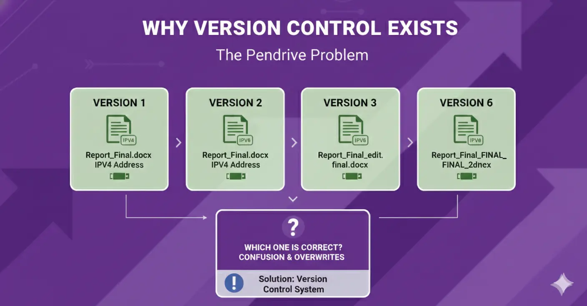
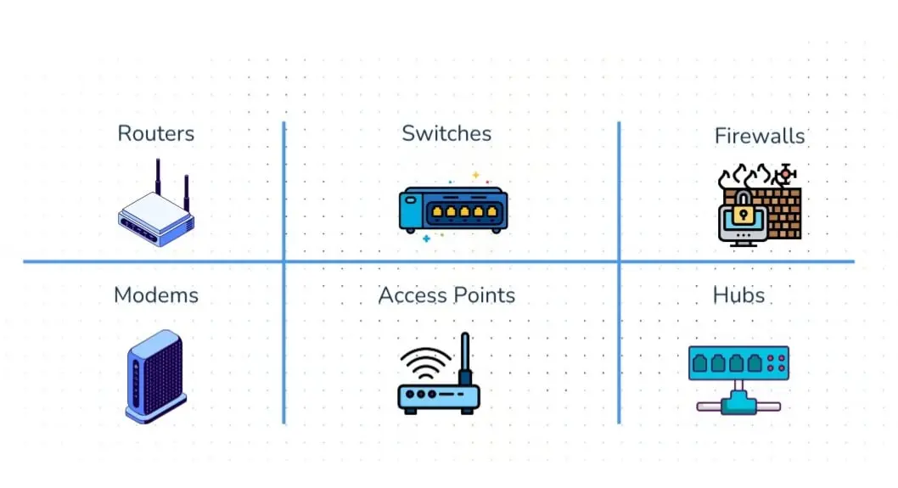
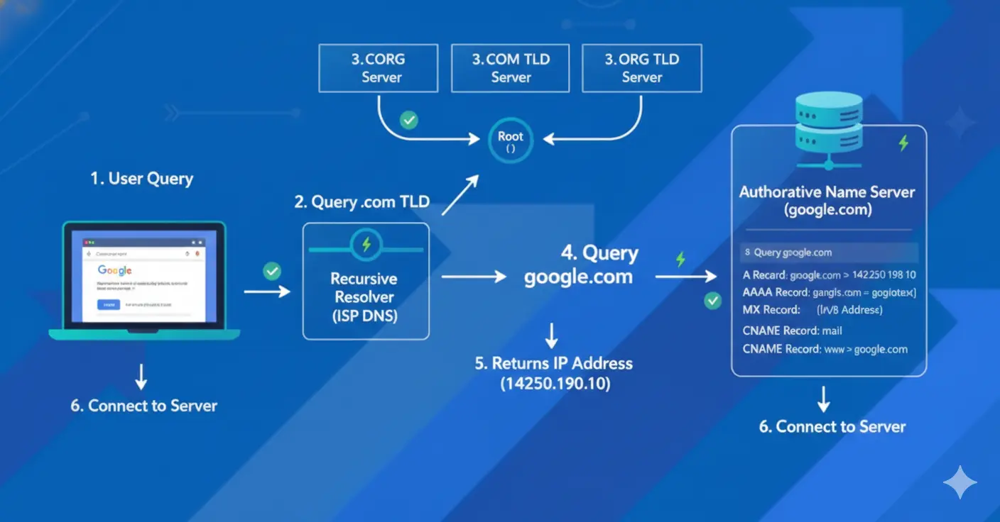
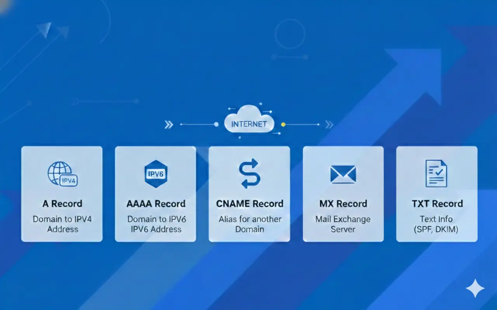
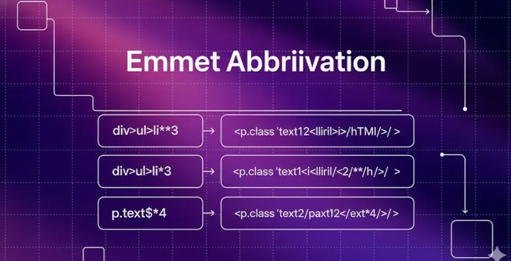
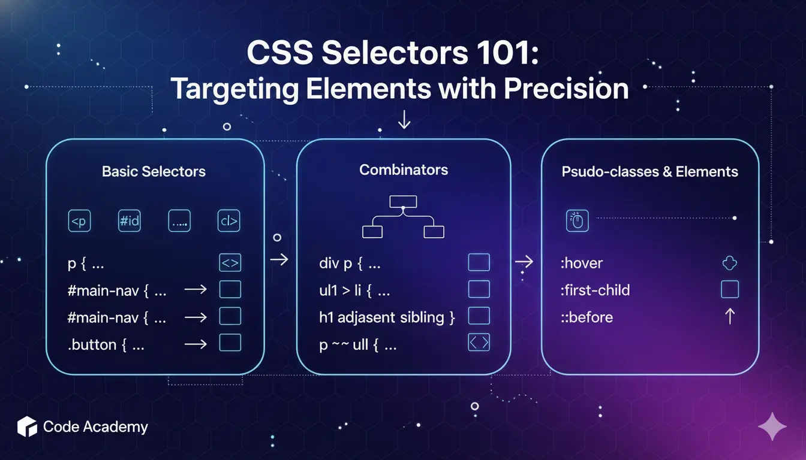
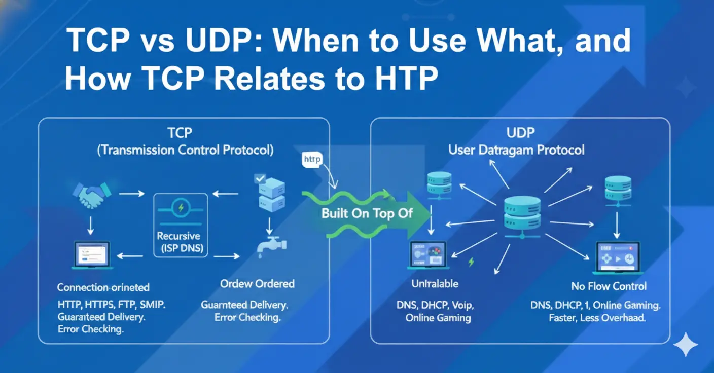
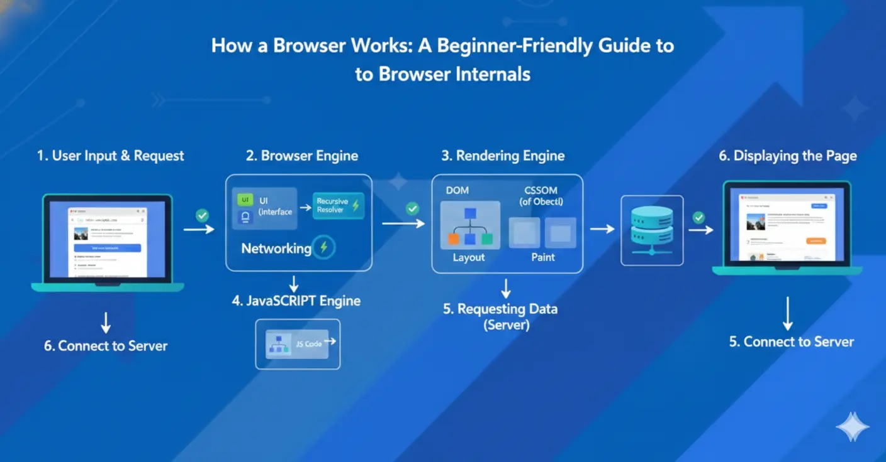

<a href="https://hashnode.com/@dipali20">
 <h1 align="center">Blogs</h1>
</a>

  
  
  

  Showcase of all the learning I did through reading, understanding and writing the blogs for future devs.

  
  [Git for Beginners: Basics and Essential Commands](https://sharmadipali14.hashnode.dev/git-for-beginners-basics-and-essential-commands)
  <a href="https://sharmadipali14.hashnode.dev/git-for-beginners-basics-and-essential-commands">
      

      
    

  </a>

 

[Why Version Control Exists: The Pendrive Problem](https://sharmadipali14.hashnode.dev/why-version-control-exists-the-pendrive-problem)

  <a href="https://sharmadipali14.hashnode.dev/why-version-control-exists-the-pendrive-problem">
      

      
    

  </a>

 

[Inside Git: How It Works and the Role of the .git Folder](https://sharmadipali14.hashnode.dev/inside-git-how-it-works-and-the-role-of-the-git-folder)

  <a href="https://sharmadipali14.hashnode.dev/inside-git-how-it-works-and-the-role-of-the-git-folder">
      

      
    

  </a>

 

[Understanding Network Devices](https://sharmadipali14.hashnode.dev/understanding-network-devices)

  <a href="https://sharmadipali14.hashnode.dev/understanding-network-devices">
      

      
    

  </a>

 

[The Terminal's Hidden Power: Understanding cURL
](https://sharmadipali14.hashnode.dev/the-terminals-hidden-power-understanding-curl)

  <a href="https://sharmadipali14.hashnode.dev/the-terminals-hidden-power-understanding-curl">
      

      
    

  </a>

 

[How DNS Resolution Works](https://sharmadipali14.hashnode.dev/how-dns-resolution-works)

  <a href="https://sharmadipali14.hashnode.dev/how-dns-resolution-works">
      

      
    

  </a>

 

[DNS Record Types Explained](https://sharmadipali14.hashnode.dev/dns-record-types-explained)

  <a href="https://sharmadipali14.hashnode.dev/dns-record-types-explained">
      

      
    

  </a>

 

[Learn Emmet Abbreviation](https://sharmadipali14.hashnode.dev/learn-emmet-abbreviation)

  <a href="https://sharmadipali14.hashnode.dev/learn-emmet-abbreviation">
      

      
    

  </a>

 

[Understanding HTML Tags and Elements](https://sharmadipali14.hashnode.dev/understanding-html-tags-and-elements)
<a href="https://sharmadipali14.hashnode.dev/understanding-html-tags-and-elements">

</a>

 

[CSS Selectors 101: Targeting Elements with Precision](https://sharmadipali14.hashnode.dev/css-selectors-101-targeting-elements-with-precision)
<a href="https://sharmadipali14.hashnode.dev/css-selectors-101-targeting-elements-with-precision">

</a>

 

[TCP vs UDP: When to Use What, and How TCP Relates to HTTP](https://sharmadipali14.hashnode.dev/tcp-vs-udp-when-to-use-what-and-how-tcp-relates-to-http)
<a href="https://sharmadipali14.hashnode.dev/tcp-vs-udp-when-to-use-what-and-how-tcp-relates-to-http">

</a>

 

[TCP Working: 3-Way Handshake & Reliable Communication
](https://sharmadipali14.hashnode.dev/tcp-working-3-way-handshake-and-reliable-communication)
<a href="https://sharmadipali14.hashnode.dev/tcp-working-3-way-handshake-and-reliable-communication">

</a>

 

[How a Browser Works: A Beginner-Friendly Guide to Browser Internals](https://sharmadipali14.hashnode.dev/how-a-browser-works-a-beginner-friendly-guide-to-browser-internals)
<a href="https://sharmadipali14.hashnode.dev/how-a-browser-works-a-beginner-friendly-guide-to-browser-internals">

</a>

 

[JavaScript Beginner Friendly : Part-1](https://sharmadipali14.hashnode.dev/javascript-beginner-friendly-part-1)
<a href="https://sharmadipali14.hashnode.dev/javascript-beginner-friendly-part-1">

</a>

 
